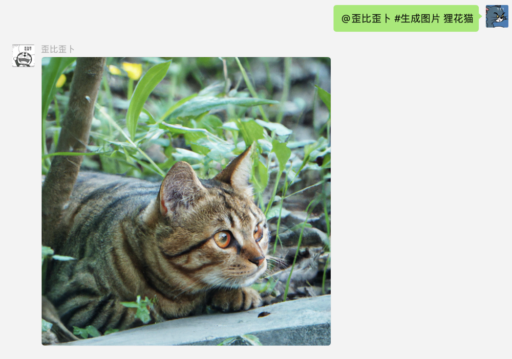

# chatgpt-empower-wechat

> 该项目使用chatgpt、wechaty-padlocal，可以快速搭建属于自己的微信机器人。

## 功能

- [x] 支持根据上下文对话。(注：上下文语境消失时间为最后一次说话2分钟后)
- [x] 支持群聊`@机器人`进行对话。（注：复制的@并不能成功触发机器人）
- [x] 支持群聊上下文对话，每个用户是单独的上下文。
- [x] 支持生成图片，私聊机器人`#生成图片 xxxxx` ，群聊机器人`@机器人 #生成图片 xxxx`
- [x] 支持定时任务解析，定时推送天气`#`为触发条件需要包含`时间，推送，天气，和地区（不用包含省/市）`（注：试验阶段，需要多次执行命令,需要和风天气API）
- [x] 生成周/日报
- [x] 事件提醒
- [ ] 接入tg机器人，进行双向绑定
- [ ] 其他功能代开发

## 效果

1. 上下文对话
2. 群聊@机器人对话(注:群聊上下文是根据用户消息获取上下文,并不是根据群消息)
   
3. 生成图片(注: 由于wechaty原因,发送图片可能延迟很严重,为避免多次请求消耗openai额度,请谨慎使用)
   
4. 生成日报
   
5. 推送每日天气
   

## 开始

### 准备

1. 注册并获取OpenAI的[API Key](https://platform.openai.com/account/api-keys)。
2. 注册并获取Wechaty-padlocal的[token](http://pad-local.com/#/)。例：`puppet_padlocal_xxxxxxxxxxxxxx`
3. 在终端中生成UUID `uuidgen`并保存。例如：`6576FDF7-BB85-4DAD-875D-9AF9E4D77BAC`
4. (可选) 申请和风天气API

### 环境

1. 安装python3.9
2. 拉取wechaty docker镜像，配置并启动。

   ```bash
   # 需要修改WECHATY_PUPPET_PADLOCAL_TOKEN(准备中的第二条)和WECHATY_TOKEN(准备中的第三条)
   export WECHATY_PUPPET_PADLOCAL_TOKEN="{Wechaty-padlocal-token}"
   export WECHATY_TOKEN="{UUID}"
   
   export WECHATY_LOG="verbose"
   export WECHATY_PUPPET="wechaty-puppet-padlocal"
   export WECHATY_PUPPET_SERVER_PORT="9001"
   
   docker run -ti \
     --name wechaty_puppet_service_token_gateway \
     --rm \
     -e WECHATY_LOG \
     -e WECHATY_PUPPET \
     -e WECHATY_PUPPET_PADLOCAL_TOKEN \
     -e WECHATY_PUPPET_SERVER_PORT \
     -e WECHATY_TOKEN \
     -p "$WECHATY_PUPPET_SERVER_PORT:$WECHATY_PUPPET_SERVER_PORT" \
     wechaty/wechaty:0.65
   ```

3. 拉取chatgpt-empower-wechat 代码。

   ```bash
   git clone git@github.com:JasonSTong/chatgpt-empower-wechat.git
   ```

4. 安装并配置项目。

   ```bash
   cd chatgpt-empower-wechat
   cp config-tempalte.json config.json
   vim config.json
   pip3 install -r requirements.txt
   ```
   ```json
   {
     "open_ai_api_key": [""], # (必填) 准备中的第一个,OpenAiApiKey
     "wechaty_token": "",   # (必填) 准备中的第三个 uuid
     "wechaty_url": "",    # (必填) 发布wechaty-docker的ip+port
     "telegram_bot_token": "", # (可选)
     "qweather_api_key": "", # (可选 没有配置的话无法使用天气推送)
     "redis_url": "redis://localhost:6379/0" # (必填) 用于上下文管理
   }
   ```
### 运行
- 测试运行 `python3.9 main.py`
- 后台运行 `nohup python3.9 main.py >/dev/null 2>&1 &`
